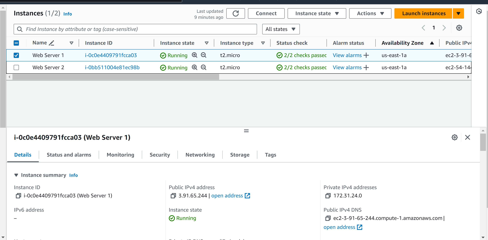

## KN02 

# a

HTML Seite 

Liste der EC2 Instanzen 

Details der Web Server-Instanz
 

Security-Group: Liste der Inbopund Regeln

# b 

Screens Liste der Buckets 

Screen von Seite und Url
    

Screen von Dateien im Bucket 

Screen von Properties Static website hosting

Json Bucket Policy

# B 

Screen erster Schlüssel 

Screen zweiter Schlüssel 

Screen vom verwendeten Schlüssel 
