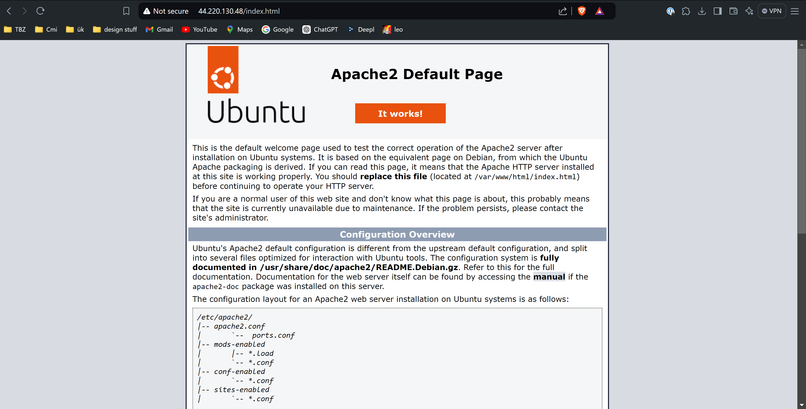
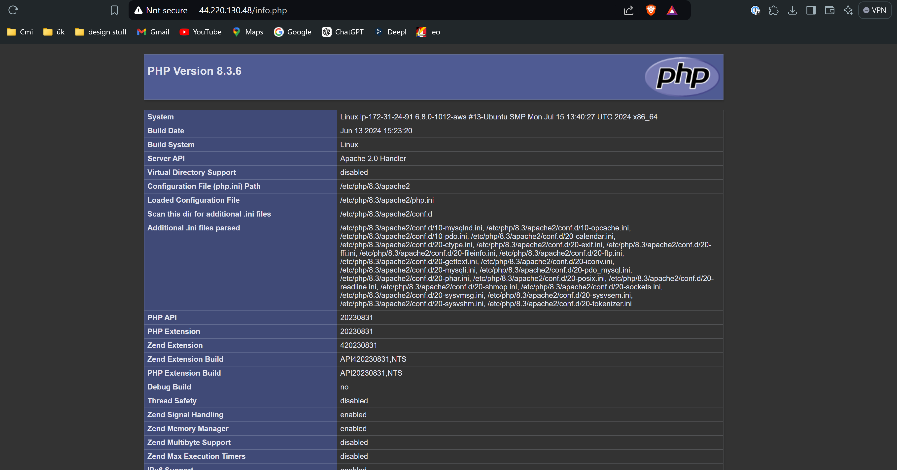
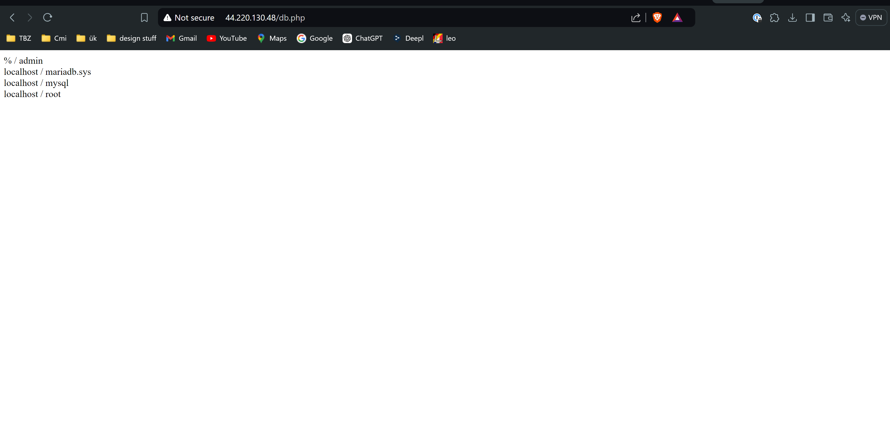
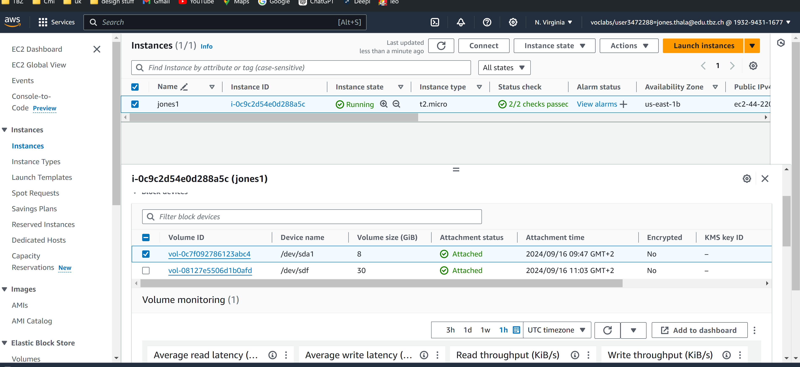

## A 

### Screens von funktionierende Websiten mit URL

## B 

 

### kurze erklärung: Sicherzustellen, dass wichtige Daten auf einem separaten Volume gespeichert werden, um Datenverlust bei einem Problem mit dem Hauptbetriebssystem zu vermeiden.
