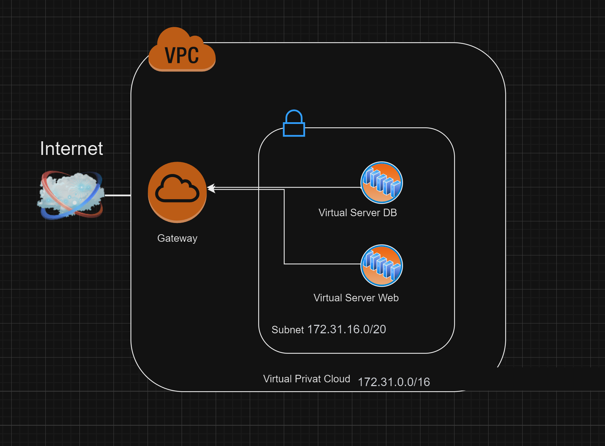
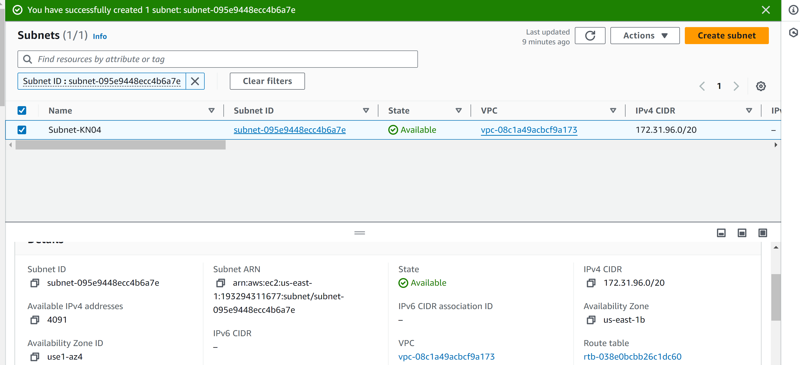
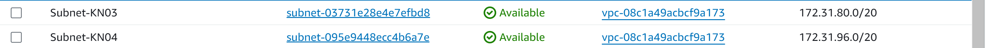
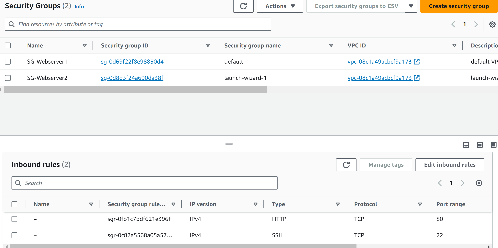
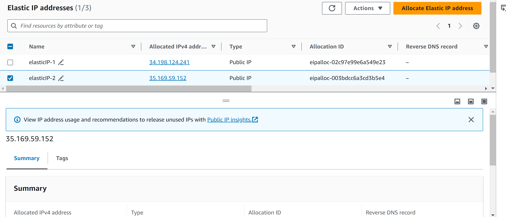
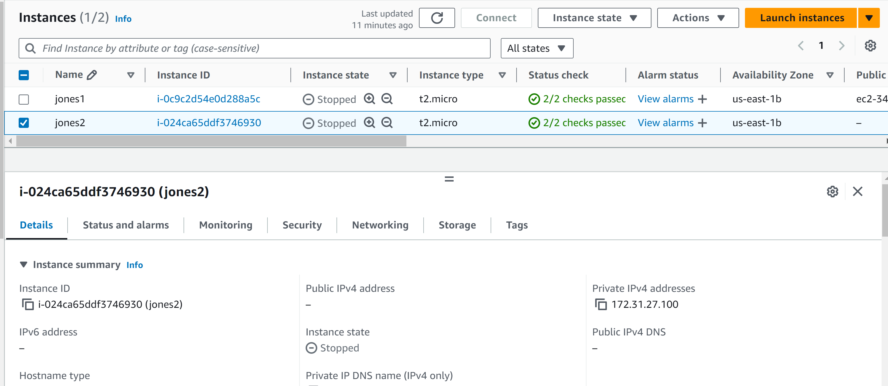
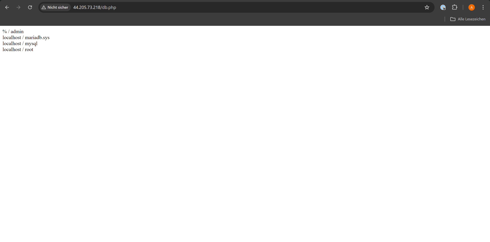
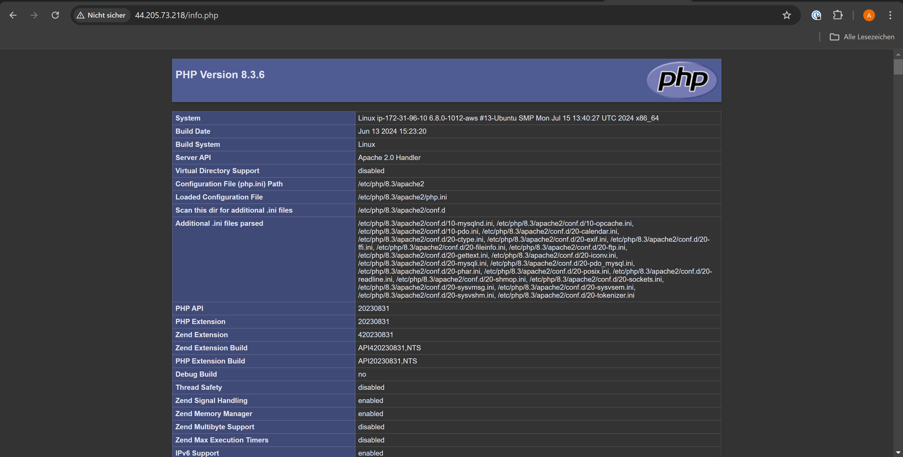

## A

## B 

### db und web = 172.31.96.10/20

## C 

### Subnetze 

### Private Ips für VMs

IP für KN04 Webserver: 172.31.96.10

IP für KN04 Datenbank: 172.31.96.20

### Security Groups

 

### Elastic Ip 

 

### Stopped Instances

 

 ### Screens von den Sieten 

  

 

 