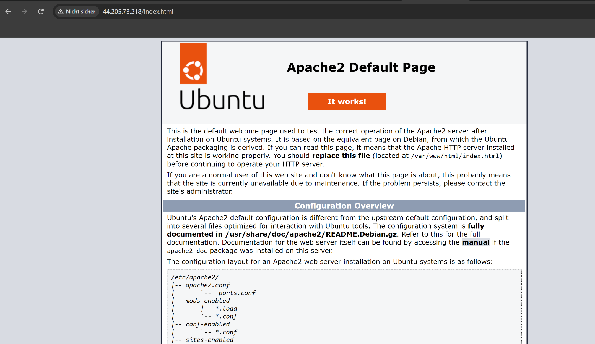
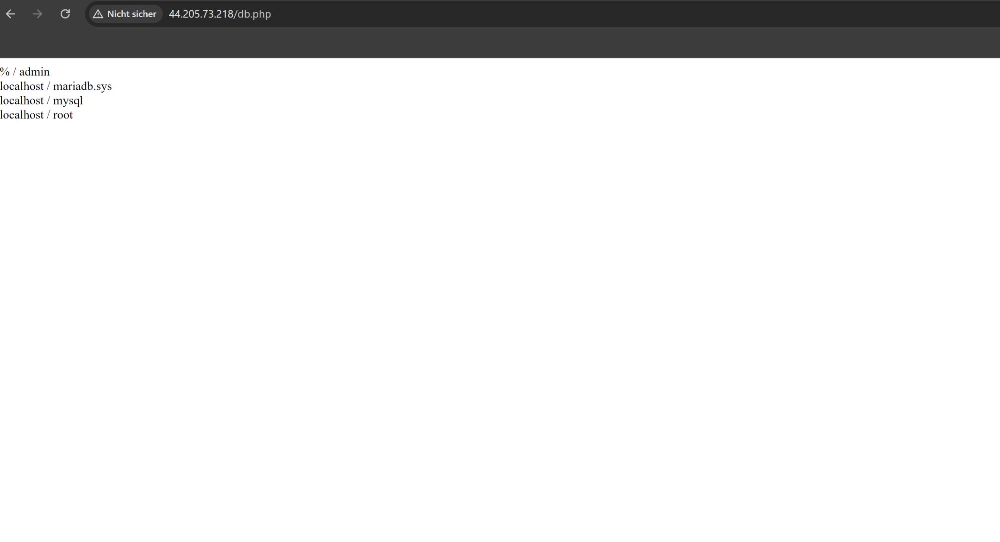
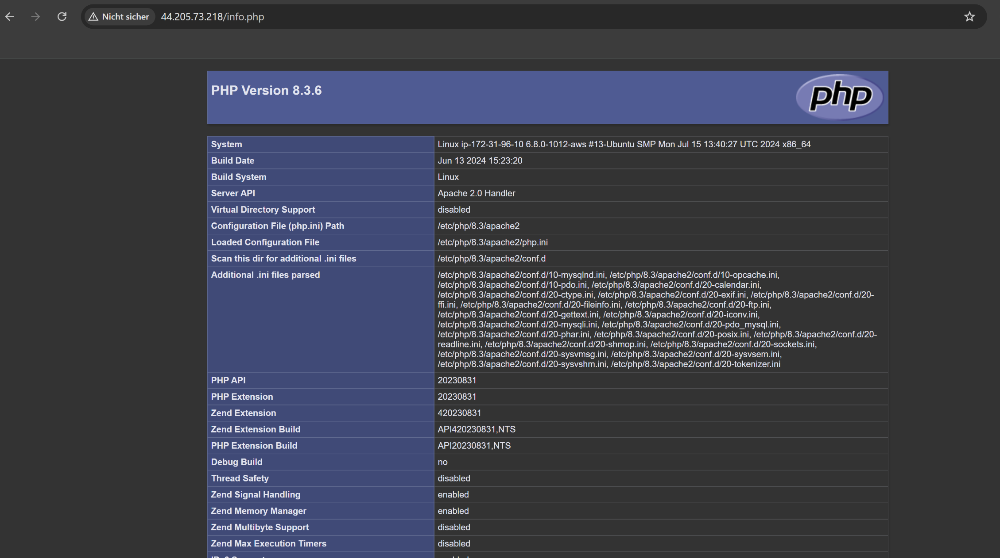

## A

Was ist ein VPC?
VPC (Virtual Private Cloud) ist ein isolierter Netzwerkbereich in einer Cloud-Umgebung, der es Nutzern ermöglicht, eigene virtuelle Ressourcen (z. B. Server) zu erstellen und zu verwalten. 
VPCs bieten Sicherheitsfunktionen und ermöglichen die Anpassung von Netzwerkressourcen.

Was ist ein Subnetz?
Ein Subnetz ist ein kleiner Teil eines VPCs, der eine Gruppe von IP-Adressen definiert. Es hilft, Ressourcen zu organisieren und zu verwalten, 
indem es unterschiedliche Sicherheits- und Zugriffsrichtlinien für verschiedene Teile des Netzwerks ermöglicht. Subnetze können öffentlich (Zugriff aus dem Internet) oder privat (kein Internetzugang) sein.

## B 

### db und web = 172.31.96.10/20

## C 

### Subnetze 

### Private Ips für VMs

IP für KN04 Webserver: 172.31.96.10

IP für KN04 Datenbank: 172.31.96.20

### Security Groups

 

### Elastic Ip 

 

### Stopped Instances

 

 ### Screens von den Seiten 

 

 

 