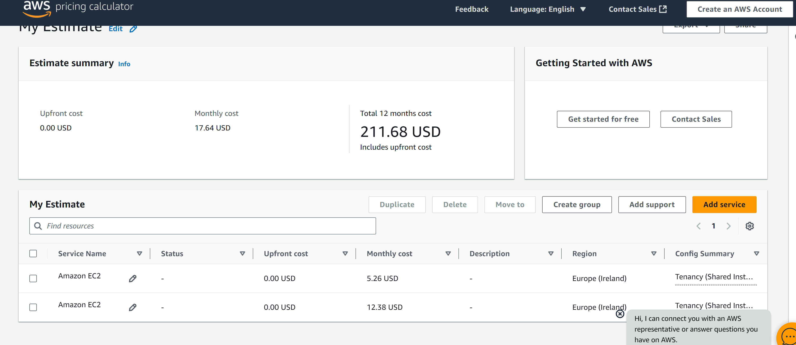
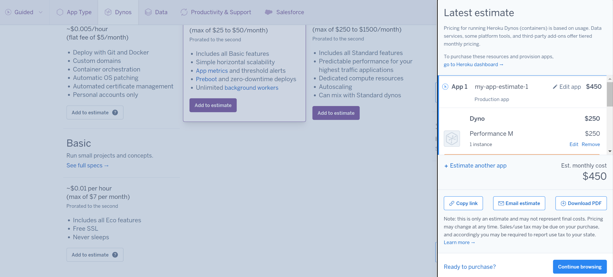
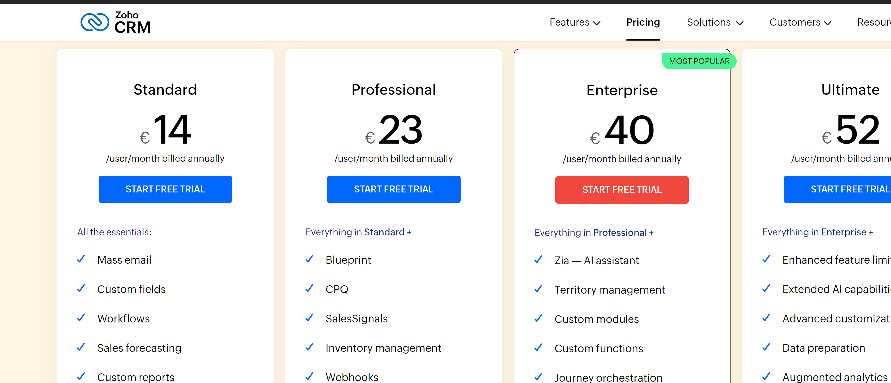
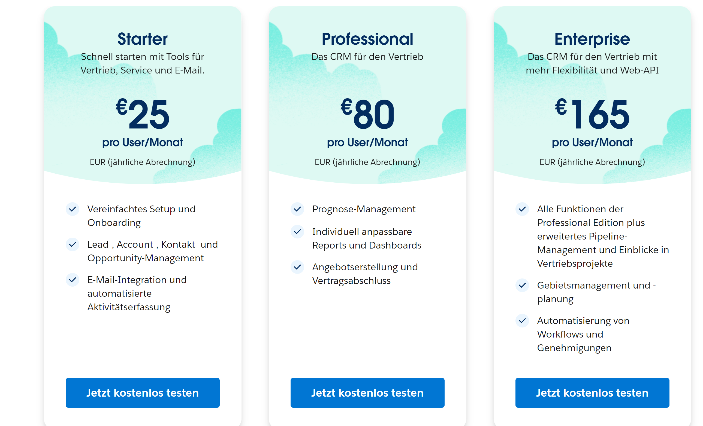

## KN10 

### 1. Rehosting 

### 2. Replatforming 

 

Bei Heroku ist das schon weniger teuer 

### 3. Repurchasing 

 

### Vergleich zz IAAS und PAAS 

Die SAAS-Lösung ist deutlich teurer als die IAAS- und PAAS-Alternativen und wird zudem nach der Anzahl der Mitarbeiter abgerechnet.

Bei internen Anwendungen muss man natürlich auch die Kosten für Entwickler berücksichtigen, die für Updates und Wartung der Applikation zuständig sind.

Wenn ein Unternehmen bereits eine funktionierende Anwendung hat und mindestens 20 Mitarbeiter beschäftigt, ist es sinnvoller, die Anwendung manuell in die Cloud zu migrieren.

Hat ein Unternehmen hingegen noch keine bestehende Applikation, kann es vorteilhaft sein, SAAS zu nutzen – es sei denn, es handelt sich um eine große Firma.

### Interpolation der Resultate 

Die Preisunterschiede zwischen den Angeboten sind erheblich, insbesondere beim SAAS-Modell, das bis zu zehnmal teurer ist. Die kostengünstigste Option wäre die Migration der Anwendung auf Azure mithilfe von IAAS. Allerdings würde dies einen erheblichen Aufwand an Entwicklerzeit erfordern.

Das SAAS-Modell ist insgesamt das teuerste, und das um ein Vielfaches. Dabei ist jedoch nicht berücksichtigt, dass bei den IAAS- und PAAS-Modellen zusätzliche Kosten für die Bezahlung von Entwicklern anfallen, um die Anwendung zu entwickeln, zu hosten sowie regelmäßige Updates und Wartungen durchzuführen. Diese Personalkosten könnten in diesen Fällen ähnlich hoch ausfallen wie die Gesamtkosten des SAAS-Modells.